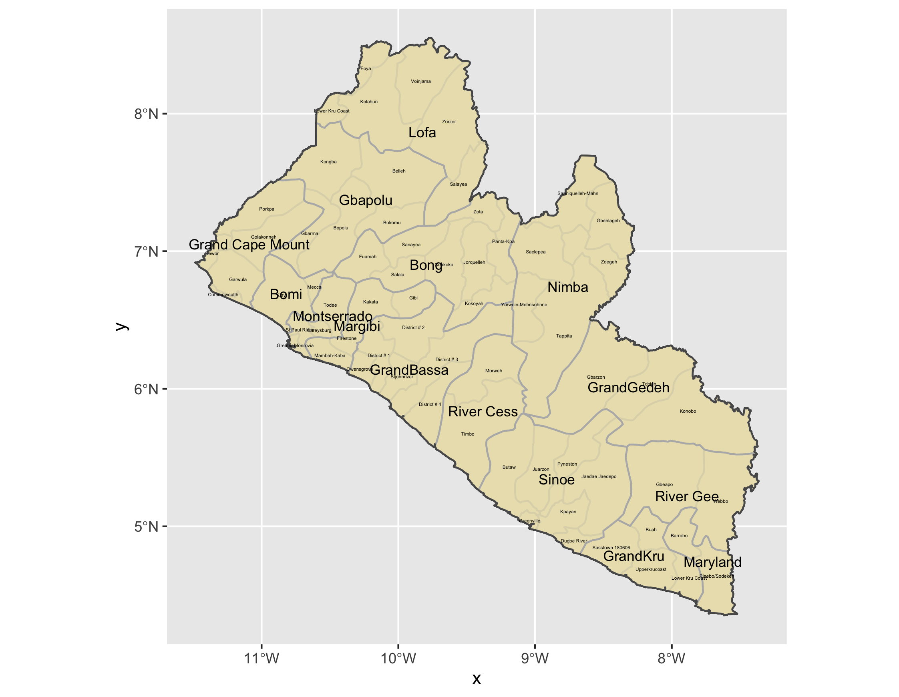
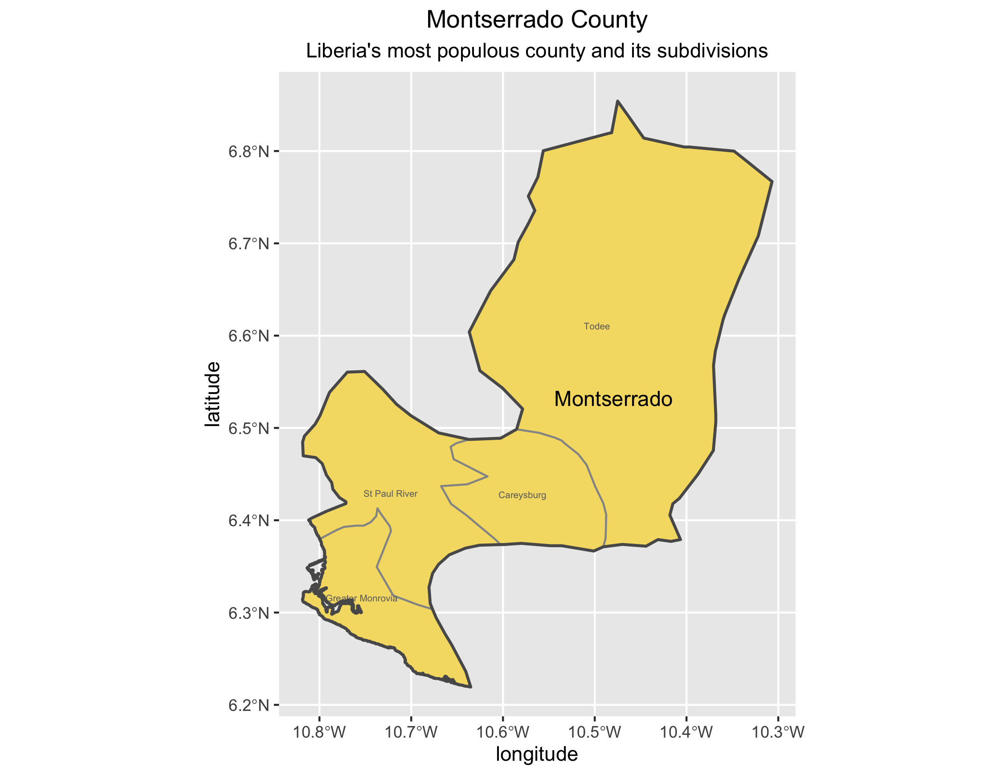
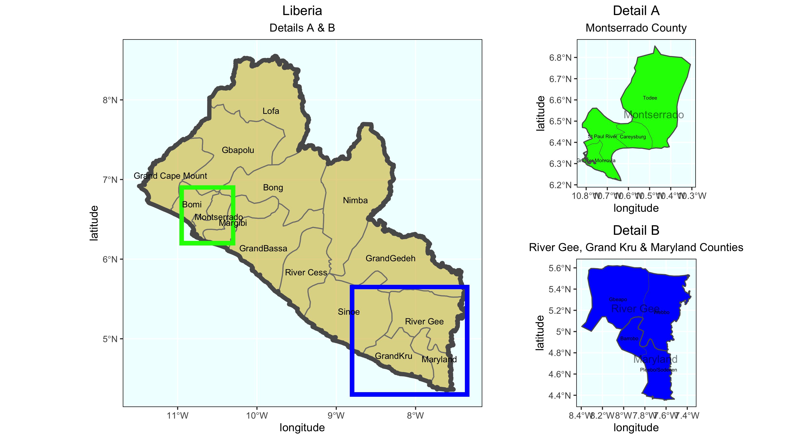

# Projecting, Plotting and Labelling Administrative Subdivisions

### Map of Liberia 
A labeled map of the national boundary and first and second level administrative subdivisions of Liberia. 

### Map of Montserrado

A labeled map of Montserrado County in Liberia and its subdivisions. 

### Map of Liberia with Accompanying Detail Maps.

A labeled map of the national boundary and first and second level administrative subdivisions of Liberia with blue and green detail boxes highlighting the River Gee, Grand Kru & Maryland Counties and Montserrado Countries, respectively. 
On the side are two detail maps. The top map, Detail A, highlights the Montserrado County and its subdivisions. The bottom map, Detail B, highlights the River Gee, Grand Kru & Maryland Counties and their subdivisions. 

