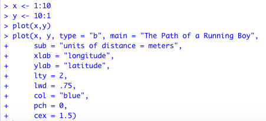
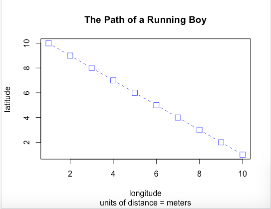
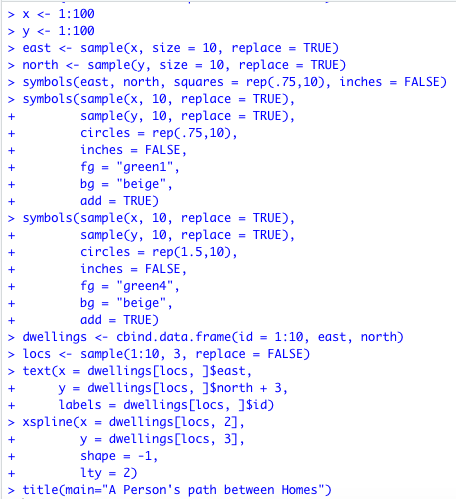
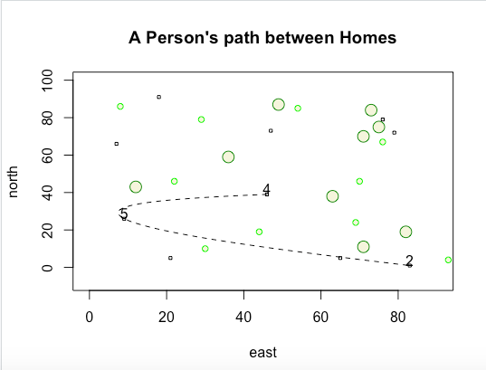

# Getting Started With R 
## Creating and Plotting Objects 
Below is a fully labelled plot of objects "x" and "y". The points are represented by squares and connected by a blue dotted line.

 

## Creating a More Complicated Plot while also creating and then using a Data Frame
Below is a fully labelled plot where squares are used to represent locations of "dwellings", smaller circles are used to represent "small trees", and larger circles are used to represent "large trees". Three squares are numbered and connected using a spline to represent a person's continous path between three randomly chosen dwellings. 

 

## Challenge Question
Below is a fully labelled plot where squares are used to represent locations of "dwellings", smaller circles are used to represent "small trees", and larger circles are used to represent "large trees". There are 40 squares of size 15 and 50 smaller circles of size 10 so that the dwellings and small trees are approximately the same radius. There are 12 larger circles of size 20 to demonstrate that the large trees are bigger in size than the dwellings and small trees. Seven squares are numbered and connected using a spline to represent a person's continous path between seven randomly chosen dwellings. 

