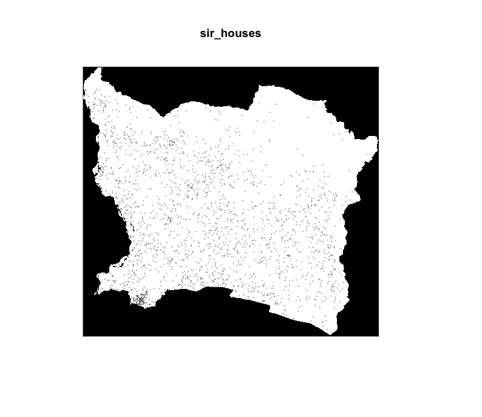

                                                Household Survey Information

## Retrieving Data
To retrieve country survey data from the DHS, I created a research proposal that explained my use of Nepal's survey data:

I’m an undergraduate student in a 400-level class about agent-based modeling. For my research project, I am developing an agent based model of Nepal in order to better understand human behavior, transportation, and health-care in the Himalayas.
With the DHS Nepal data, I will be creating multinomial logistic regression modelsto generate a closer-to-reality synthetic population by specifying, estimating,and validating a continuous spatial model. This model would be compared to myprevious work estimating a discretized spatial model of Bhutan. 
Central to achieving this research goal of continuous spatial multinomial logistic regression model (for inferring conditional probabilities) will be increasing the resolution of the sampling unit from political subdivisions to individual households. I will achieve this goal by meeting the following objectives.
1. Use remotely sensed data to estimate all dwelling unit locations
across Nepal.
2. Use survey data to estimate a spatially continuous multinomial logistic regression model for predicting household size, gender and age of all dwelling units across Nepal.
3. Use survey data to estimate a spatially continuous multinomial logistic regression model for predicting the remaining demographic characteristics of all household members.
References
[1] Adrian Baddeley, Ege Rubak, and Rolf Turner. Spatial Point
Patterns: Methodology and Applications with R. CRC Press, 2016.
[2] Tyler Frazier and Andreas Alfons. “Generating a close-to-reality synthetic population of Ghana”. unpublished. accessible at https://works.bepress.com/tylerfrazier/. 2012.

## Survey Information 

From the 2016 Nepal Households survey, I was able to determine the dataset labels for the following information:  
Survey weights: hv005  
Number of household members: hv009  
Location of selected area: SHDIST - 16 (Siraha, Province 2, Nepal)  
Gender of household members: hv104  
Age of household members: hv105  

## Siraha, Nepal  Information

For my location, I chose the district of Siraha, Nepal. Siraha lies within Province 2. It shares a border with India and is one of the few districts that has an agreed route for Mutual Trade with India. Major cities in the district are connect by the Mahendra National Highway and smaller towns are connected by the more rural Postal Highway.  

## Map of Households in Siraha, Nepal
Below is a map of Siraha that shows the distribution of households in the district, as found using the survey.

