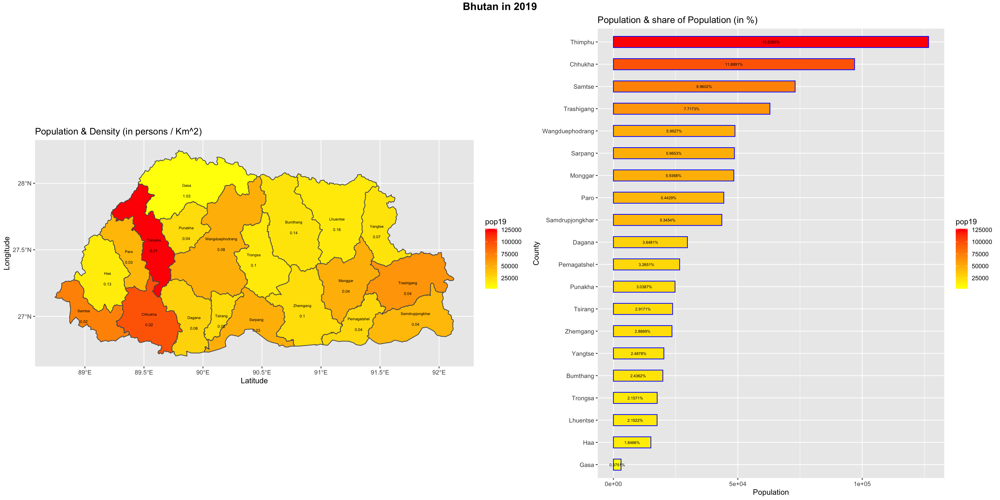
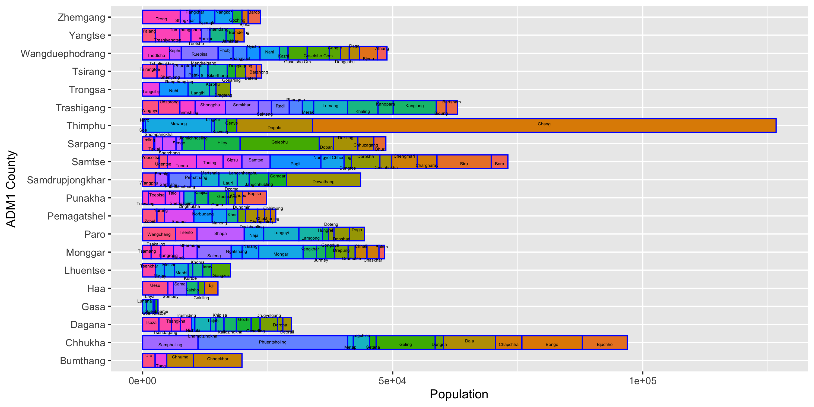
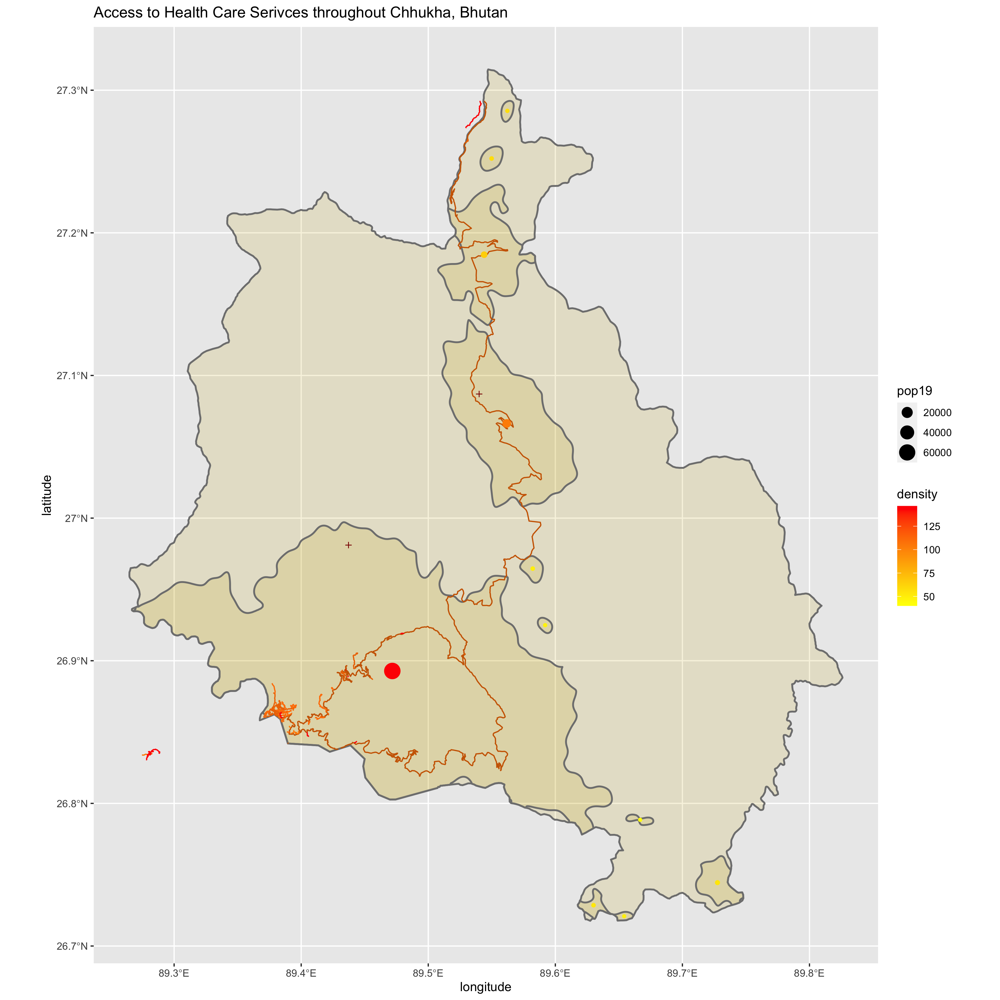

# Project 1

## Geometric Bar Plot

Plot 1, *Bhutan in 2019*, consists of two subplots. On the left, plot 1 depits a map of Bhutan's adm1 subdivisions. Each subdivision is colored using a gradient to represent population size, as described by the legend "pop19". Each adm1 is labelled with its name and population density.
On the right, plot 1 uses a bar plot to illustrate the population size of each Bhutan adm1 subdivision in 2019. The x-axis represents population size and the y-axis marks each subdivision. The bars are labelled with the percentage of the total population and colored using a gradient to represent population size.

Plot 2, *Population of Bhutan in 2019 Subdivided by ADM2*, is a bar plot of the population of Bhutan in 2019 broken down by adm2. The x-axis represents population size and the y-axis marks each adm1 subdivision. Each bar is subdivided by the adm2s within the adm1. The adm2s has a unique color fill to show differentiation, and its size is reflective of the proportion of the population that lives in the area. 

### Analysis:
Information from both plot 1 and 2 led me to deciding to focus in on the subdivision of Chhukha. Plot 1 demonstrated that the two highest population areas in the country were the adm1s Thimphu and Chhukha. The bar plot revealed that both areas had a population of around or just above 100,000 people, which was my target population for my subdivision. This led my decision to focus on an adm1 subdivision instead of an adm2 subdivision. To decide between Chhukha and Thimphu, I used plot 2. Plot 2 revealed that while Thimphu has the higher population, most of its population is concentrated in one adm2 subdivision. After some research, I discovered that this was because the adm1 Thimphu holds the country's capital, also named Thimphu. Chhukha, on the other hand, had a more even distribution of its population across its adm2s. I believed that this distribution of the population across the division would allow me to map more defacto settlements than I could in densly populated Thimphu. My decision to focus on Chhukha was confirmed by the map in plot 1. The map showed that Chhukha borders India. Research revealed that Chhukha has the only border crossing that accepts foreign nationals in Bhutan. I believed that this would allow me to successfully model movement across the area. 

## Defacto Settlement Boundaries

Plot 3, *Access to Health Care in Chhukha, Bhutan*, is a map of Chhukha, an adm1 subdivision of Bhutan. Inside the map are the 11 main settlements in Chhukha, represented by the dark gold regions. Within each settlement there is a dot whose size represents the settlement's population and color the denisty of the population based on the area. 

### Analysis:
The largest settlement is in the southwest corner of Chhukha. This region borders India and contains the only border crossing in Bhutan that accepts foreign nationals. As a high-traffic area, this region has a larger population and density than the other settlements in Chhukha. The exact town in the settlement that contains the border crossing, Phuentsholing, is represented by the densest pocket of roads in the settlement. Outside of Phuentsholing, there are two main roads in the settlement that split, travel around the settlement, and then rejoin at the northeast corner. This road leaves the main settlement, crosses through the entire subdivision, and ends in the northeast border of Chhukha. Along this road are six settlements that have populations of <2000 and low to medium density. This reflects the idea that settlements with smaller populations are often along roads to increase their accessibility. Plot 3 also shows three settlements that are not near the road system. These settlements lay along the southern border of Chhukha. While they are not near any mapped roads, these border settlements with low population (<2000) and density demonstrate the existance of smaller border crossings for the Bhutanese and Indians (who have different border crossing rights than other foreign nationals). Also mapped are the two health care facilities that were recorded in the files (represented by red plus signs). Chhukha has a relatively small population, so a low number of health care facilities was expected. One of these facilities exists along the main road within the second largest settlement in Chhukha. Because it exists along the main road, this facility is also accessible to the other northeast settlements. The second healthcare facility exists in the largest settlement in Chhukha; however, it is not next to any mapped roads. This demonstrates that either local roads are not well-mapped in Bhutan or the healthcare facility was not properly mapped. 
