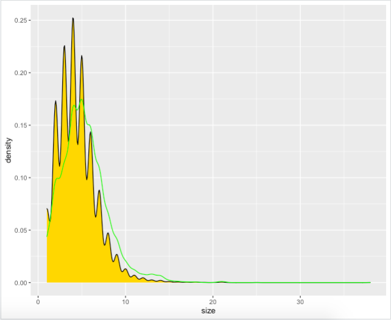
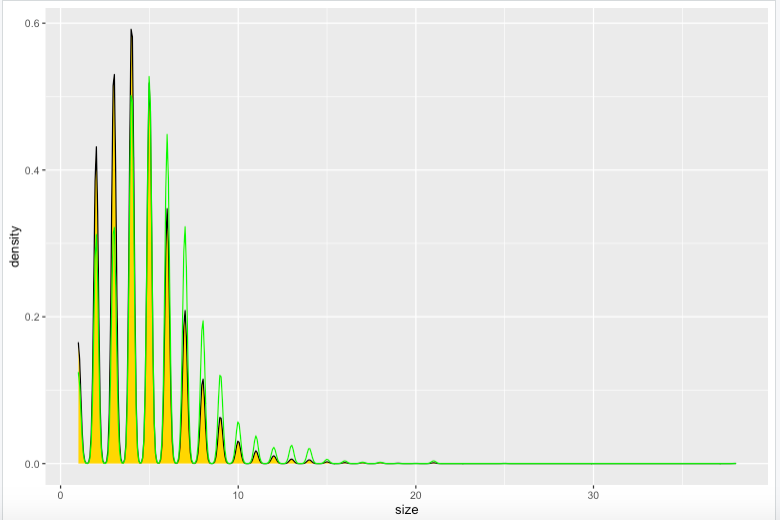

***Provide a written description of your selected household survey including the number of household and person observations as well as the variables in your source data.***

For this project, I aimed to create a synthetic population of an adm1 and adm2 region in Nepal. Having an accurate population is important for any agent-based model; however, since populations are constantly growing and population surveys are often infrequent, it is often most effective to make a synthetic population. My synthetic population is modeled off of a DHS household survey of Nepal from 2016. I obtained this data via the following research proposal: 
> I’m an undergraduate student in a 400-level class about agent-based modeling. For my research project, I am developing an agent based model of Nepal in order to better understand human behavior, transportation, and health-care in the Himalayas. With the DHS Nepal data, I will be creating multinomial logistic regression modelsto generate a closer-to-reality synthetic population by specifying, estimating,and validating a continuous spatial model. This model would be compared to my previous work estimating a discretized spatial model of Bhutan. Central to achieving this research goal of continuous spatial multinomial logistic regression model (for inferring conditional probabilities) will be increasing the resolution of the sampling unit from political subdivisions to individual households. I will achieve this goal by meeting the following objectives.
> 1. Use remotely sensed data to estimate all dwelling unit locations across Nepal.
> 2. Use survey data to estimate a spatially continuous multinomial logistic regression model for predicting household size, gender and age of all dwelling units across Nepal.
> 3. Use survey data to estimate a spatially continuous multinomial logistic regression model for predicting the remaining demographic characteristics of all household members. 

> References: [1] Adrian Baddeley, Ege Rubak, and Rolf Turner. Spatial Point Patterns: Methodology and Applications with R. CRC Press, 2016. [2] Tyler Frazier and Andreas Alfons. “Generating a close-to-reality synthetic population of Ghana”. unpublished. accessible at https://works.bepress.com/tylerfrazier/. 2012.

The household survey reports data for 11,040 households across 3,920 variables. To create my model, I focused on the following variables (with their column label):
- Household ID (hhid)
- Unit (hv004)
- Survey weights (hv005/1000000)
- Province (hv024)
- District (shdist)
- Size (hv009)
- Gender (columns 350-387)
- Age (columns 388-425)
- Education (columns 426-463)
- Wealth (columns 426-463)

In this dataset, each row represents one household and every person in the household is represented by a column. For example, the "Gender" variable spans 38 columns because every household member is represented by one column and the largest household in the dataset has 38 members. To determine the total number of people in the survey, I pivoted the columns representing household members, creating a dataset where every row represents a person. This demonstrated a total of 49,064 person observations in the household survey.  

***Provide a written description of your spatially located households at the adm0 level of your selected location, including how you located each household, generated the household structure including demographic attributes of persons, and the percent error calculated. If you faced computational issues at the adm0 level when attempting to pivot from households to persons, describe those limitations.***

I began by attempting to spatially locate all households at the adm0 level of Nepal. First, I divided the population of Nepal by the mean household size across the country to estimate the number of households across the entire province. I estimated 7,248,944 households. I then used the rpoint function to randomly generate points across the country, where each point represents a household and its geometry reflects the household's predicted planar location. I then randomly sampled the survey data as a method of expanding it to reflect the population of the country. To find the error from my randonly sampled household population I compared the population to the sum of the population weights. This revealed an error of ~0.02%. 

Unfortunately, I was not able to further analyze a synthetic population of my adm0 because I was unable to pivot my data from households to persons. I did not have enough computational power to complete the pivot. As such, I moved to create a synthetic population of the next administrative division. 

*Provide a written description of your spatially located households at the adm1 level of your selected location, again including how you located each household, generated the household structure including demographic attributes of persons, and the percent error calculated. Further analyze your synthetically generated households and persons with regard to percent error. Do you think this population is more or less accurate than the one generated at the adm0 level? What could you have done to improve your measures of accuracy?*

After facing computational power limitations with my adm0, I wanted to move to an adm1 region of Nepal--Province 2. Province 2 is a southeastern region of Nepal that borders India. Subsetting the household survey by province revealed that the survey reported on 1,626 households in Province 2. I used this information to estimate the size and spread of the population of Province 2. 

First, I divided the population of Province 2 by the mean household size to estimate the number of households across the entire province. I estimated 1,239,943 households. I then used the rpoint function to randomly generate points across the province, where each point represents a household and its geometry reflects the household's predicted planar location. To compare the size of households in Nepal (gold) versus in Province 2 (green), I created the following graphs. 
 

The first graph demonstrates that the Province 2 dataset underestimates the household populations. The second graph uses random sampling to create a synthetic population similar to Province 2. When those populations are compared, the Province 2 dataset follows the population trend fairly closely. 

I then randomly sample the subsetted survey data to expand the household population to be proportionate to Province 2. Here, I found the error from my randonly sampled household population by comparing it to the sum of the population weights. This revealed an error of ~19%. This is significantly more error than that in my adm0 household population, which demonstrates that this population is less accurate than the one generated at my adm0 level. I could have improved this accuracy by basing my household population on the actual household location data collected by the DHS. However, I was unable to obtain that data, which caused more uncertainty in house locations in my more granular adm1 data. 

Once the households have been generated, I expand the survey data from household to persons. I do this by pivoting all person columns (gender, age, education). I initially had issues with pivoting the data because of the large number of observations. To have enough computational power, I removed all unnecessary columns prior to running the pivot code.

Below is a plot of the synthetically generated population for Province 2. The empty areas on the northwest and northeast areas of the map are the Parsa National Park and Koshi Tappu Wildlife Reserve, respectively. Overall, the province is more densly populated in the south and becomes sparser in the north because the northern section of the province has a higher elevation and is lined with mountains. 

***When compared to a randomly generated synthetic population that describes the demographic attributes of households and persons, does yours more closely approximate reality? How is yours an improvement over a synthetic population that was generated in accordance with complete spatial randomness? Generate plots and incorporate results from your work as evidence in support of an argument that the synthetic population you generated is a good approximation of the reality that existed in your selected location at that given time.***

Overall, my synthetically generated population more closely approximates reality than a synthetic population generated with spatial randomness because of the real data that acts as the backbone to my project. Every data point in my synthetic population was created based on a representative sample of the actual population. This guarantees a certain level of accuracy in the demographic attributes of the households and persons. Spatially, my population is also more accurate than a spatially random population because my household locations were generated based on exising information of the density of the population in each area of the country. 

To demonstrate the power of my synthetic population, I began by creating heatmaps with the raw, scaled, normalized, and percentized data. Each heat map contains all of the possible combinations between all of the main demographic attributes I studied. The heat map with the most purple has the least predictive power. The heat maps show that the percentized data has the most predictive power. 

