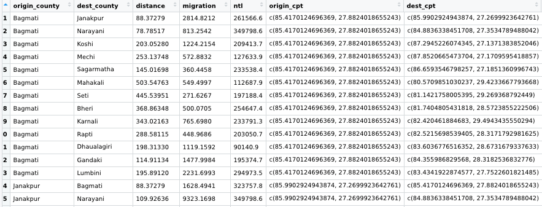
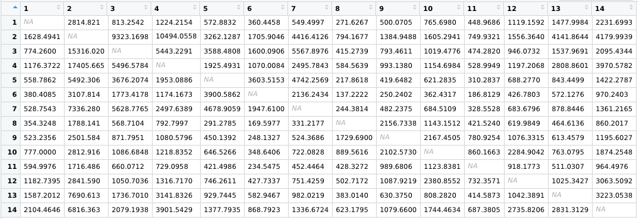
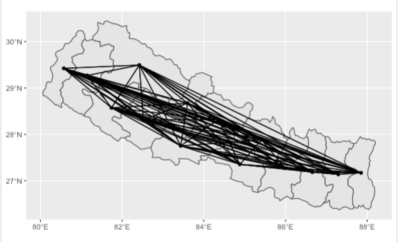
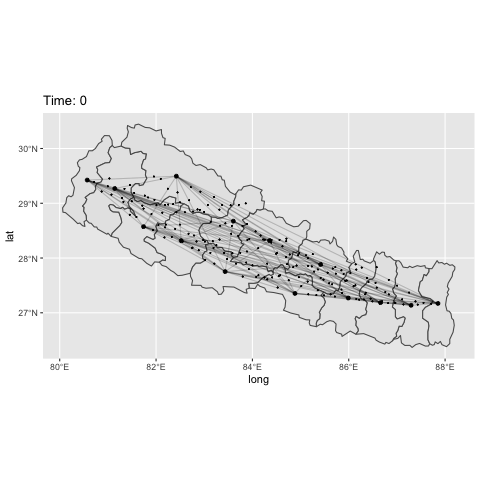
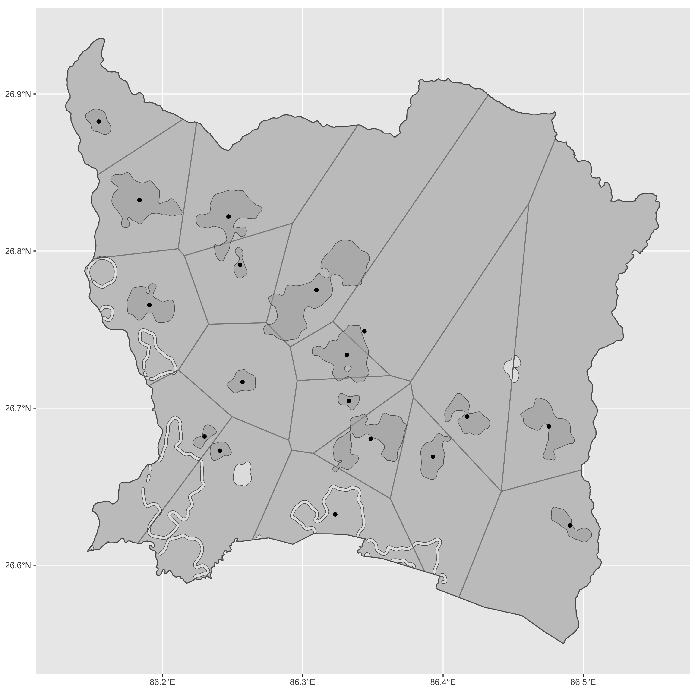

                               Final Project: Gravity Model of Nepal  
    
The goal of the final project to model movement across Nepal. 

## Analysis of London Gravity Model 
As an introduction to spatial interaction modeling, I attempted to create a gravity model of London using "Dr Ds Idiots Guide to Spatial Interaction Modelling for Dummies". To model movement across London, I used census data that reported people's home, workplace, and mode of transport. Using this data, along with calculating the distance between each borough, I was able to estimate commuter flows across the city.  I used this commuter flow data (which excludes commutes that occur internally within each borough) to make a matrix showing movement between the London boroughs. Below is the resulting origin-destination matrix. Each cell of the matrix represents the flow estimate between its row and column boroughs.  

This exercise not only helped me practice coding a gravity model, but it also taught me about the theory behind modeling movement. The guide explained that gravity model equation is based on the idea that flow between two places is proportional to the mass at the destination and origin and the inverse of their distance. This means that as mass at a point increases, the flow between them increases. Further, as the distance between two places increases, the flow decreases. This gravity model theory was echoed in the Garcia et al. paper, "Modeling internal migration flows in sub-Saharan Africa using census microdata". The paper also stressed the importance of another factor of gravity modeling: variable selection. Flow is largely influenced by job commute; however, it can also be affected by more unexpected variables such as destination attractiveness or average salary in an area. Garcia et al. found that a strong driving factor for migration in sub-Saharan Africa was males looking for economic opportunity. As a result, they were careful to select variables such as "proportion of males in a region" to account for this important source of migration.  All of this information on spatial modeling techniques from "Modeling internal migration flows in sub-Saharan Africa using census microdata" and "Dr Ds Idiots Guide to Spatial Interaction Modelling for Dummies" helped me develop a strong approach for creating my own gravity model for Nepal. 

## In/Out Migration in Nepal
For my final project, I modeled migration patterns across Nepal. To do this, I needed spatial data, migration flow data, and data for another contributing factor to migration in Nepal. For this extra variable, I chose to use the nighttime light data from WorldPop. Both the nighttime light and migration flow data sets are based on Nepal's pre-2015 adm2 borders. For consistency, I also used pre-2015 adm2 spatial data as the basis for my maps. To begin my project, I created spatial plots that describe the in and out migrations in each subdivision (see below). As can be seen in both plots, the highest number of in and out migrations (lightest blue) are in the administrative division of Janakpur. Janakpur sits between the districts that hold the capital of Nepal (the Bagmati district) and the district that has Mount Everest (Sagarmatha). These are two of the most desirable areas of Nepal; therefore, it makes sense that people would travel to and from these destinations, specifically through the Janakpur district. Outside of Janakpur, the plots generally show trends of having more in/out migration on the eastern side of the country and less on the western side. This is most likely due to the eastern side having more of Nepal's destinations and having a higher number of border crossings.

## Origin-Destination Matrix and Gravity Model for Nepal
After plotting the in and out migrations, I began to work on the next step of modeling movement in Nepal: creating an origin-destination matrix, similar to the one I created for the London gravity model. First, I found the distance and migration flow between each adm2 district. I also collected the nighttime lights data across the country (designated by variable "ntl"). Finally, I found the center point of each district. Altogether, I combined distance, migration flow, nighttime lights, and center points to create a table of information about movement between every district in Nepal. A sample of this table is below.

All of the information in the above table contributed to my origin-destination matrix of movement in Nepal. The below matrix has 14 rows and columns, with each representing an origin and destination subdivision. Each cell contains the migration information between the column and row subdivision. Internal migrations are not considered, so cells that represent the same origin and destination subdivision have zero migration. This matrix demonstrates spatial interactions across all of Nepal's adm2s.

Names of origin and destination administrative subdivisions:
1. Mechi  
2. Koshi  
3. Sagarmatha	  
4. Janakpur  
5. Bagmati  
6. Narayani  
7. Gandaki  
8. Dhawalagiri  
9. Lumbini	  
10. Rapti  
11. Bheri  
12. Karnali  
13. Seti  
14. Mahakali  

After creating this OD matrix, I began to make the gravity model for Nepal. To do this, I found the paths between each division, from center point to center point. These paths model the movement of people between the subdivisions, shown through the plot below. To simulate this movement, I created the gif also below. The number of dots moving along a path reflects the amount of migration between the subdivisions. The simulation illustrates five years of migration data (2005-2010). To improve the model, I would modify the time variable by using one year of data instead of five years. Using one year of data, specifically for the most recent year, would allow the model to be as up to date and close to reality as possible. 
 

## Voronoi polygons of Siraha, Nepal
To look more granularly at movement in Nepal, I created a tessellation of voronoi polygons representing Siraha-- an adm3 district in Nepal. The voronoi polygon plot illustrates the main settlements in Siraha and their center points. I can use this information to build an OD matrix for this higher resolution subdivision. To produce this matrix, I would first calculate the distance between each settlement. Then, I would search for migration data at the adm3 level, as well as data for another variable that provides information on movement between the subdivisions. For example, Nepal is very mountainous, and as such has a limited number of major roads and transportation hubs. Siraha in specific has a famous border crossing that would cause a lot of in/out migration into the area. Therefore, transportation infrastructure would play a large role in migration patterns across the subdivision. Transportation information could be obtained through the road data I used in project 1. Overall, adding this variable to my gravity model would significantly improve my model results. With information about the distance between each subdivision, transportation hubs, and migration data, I could successfully create an OD matrix for Siraha. To create a simulation of migration in Siraha, I would use the above variables to determine the appropriate number of points leaving each origin. For example, areas that have more outgoing migration, like the border crossing, would have more points than other areas because high concentrations of people attempting to leave the area for another destination. Since this data looks more granularly at movements across a higher-level administrative subdivision, I would make the time variable for the simulation a year. A year both allows me to see longer term changes in movement (such as during different seasons) while still modeling the most recent data available. A simulation with the above variables and a one year timeframe would give me a realistic model of migration across Siraha. 

