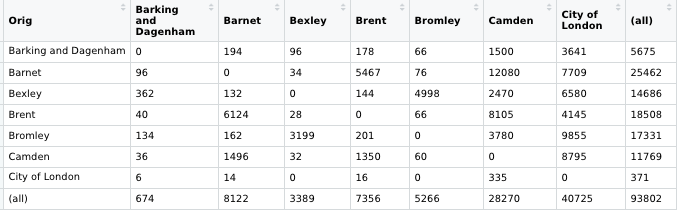
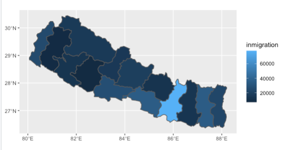
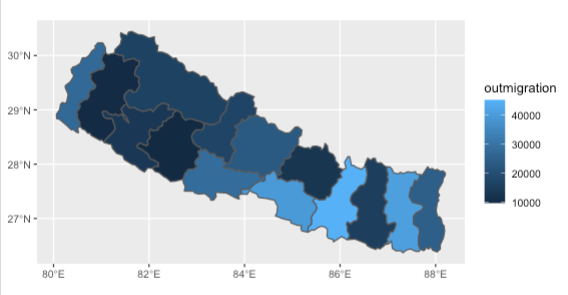

                                              Final Project: Gravity Model of Nepal
## Analysis of London Gravity Model 
As an introduction to gravity modeling, I attempted to construct a model for London using "Dr Ds Idiots Guide to Spatial Interaction Modelling for Dummies". To model movement across London, I used census data that reported people's home, workplace, and mode of transport. This data allowed me to estimate commuter flows across boroughs. Using this commuter flow data (which excludes commutes that occur internally within each borough) and the distance between each borough, I could make a model of spatial interactions across London. Below is the resulting origin-destination matrix for London. The matrix rows and columns represent the boroughs, with each cell representing the distance between each borough. 

This exercise not only helped me practice for creating a gravity model of my location, but it also taught me several important factors to consider when modeling movement. First, I learned that flow between two places is proportional to the mass at the destination and origin and the inverse of their distance. This means that as mass at a point increases, the flow between them increases. Furthermore, as the distance between two places increases, the flow decreases. Outside of these basic principles, flow is also determined by model variables. For example, flow is largely influcenced by job commute; however, it can also be affected by more unexpected variables such as destination attractiveness or average salary in an area. All of this information from "Dr Ds Idiots Guide to Spatial Interaction Modelling for Dummies" helped me understand the best approach to creating my own gravity model for Nepal. 

Additionally, incorporate the Garcia et al. paper into your description while introducing your the migration data for your selected country. Supplement your introduction with spatial plots that describe in/out migration by adminsitrative subdivision.
For my project, I model migration patterns in Nepal. For data on movement patterns, I use migration flow and nightime light data from WorldPop. These data sets are separated by Nepal's pre-2015 adm2 borders; therefore, I use pre-2015 adm2 data as the basis of my maps. To begin, I created spatial plots to describe the in and out migrations in each subdivision. As can be seen in both maps, the highest number of in and out migrations (lightest blue) are in the administrative division of Janakpur. Janakpur sits between the districts that hold the capital of Nepal (the Bagmati district) and the district that has Mount Everest (Sagarmatha). These are the two most desireable areas of Nepal; therefore, it makes sense that people would travel to and from these destinations, specifically through the Janakpur district. 

Produce an origin-destination matrix and include a portion of it as an exhibit in your write-up. Be sure to identify the number of rows in your data frame while also including the following.
Names of origin and destination administrative subdivisions
Distances between all locations
Migration flows between all locations
An additional variable that describes all origin and destinations to be used for further specification of a gravity model (one option you could use is to select night-time lights from WorldPop)
Geometric description of all origin and destination center points
Describe your OD matrix and how it is used to model migration across the administrative subdivisions that comprise your selected location.
Produce an animation of migration and elaborate on how your OD matrix and gravity model could be integrated with your simulation.
How would you modify the number of points departing from each origin?
How would you modify the time variable? What scale is the temporal dimension at this level?
How would the gravity model update these attributes in order to produce a different simulation of migration that more closely approximates reality?
At the level of your selected, higher resolution administrative subdivision (where you produced defacto descriptions of settlements), use the center points of each settlement to produce a tesselation of voronoi polygons. Similar to your analysis of the higher level administrative subdivisions, address the following.
How would you produce an OD matrix of these higher resolution entities? Which variables would you include? Are you lacking any data that would improve upon your model results?
How would you modify the number of points departing from each origin? How would you determine each points destination?
How would you modify the time variable? What scale is the temporal dimension at this level?
How would the gravity model update these attributes in order to produce a different simulation of migration?
How would you go about integrating migration and transport activities at the differing geospatial and temporal scales of these hierarchical levels?
